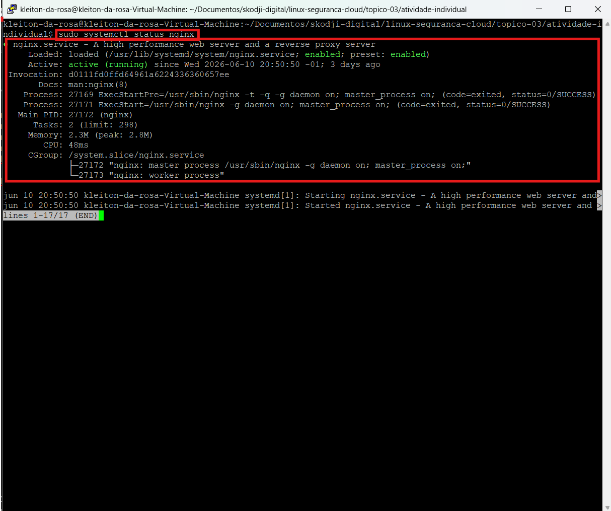
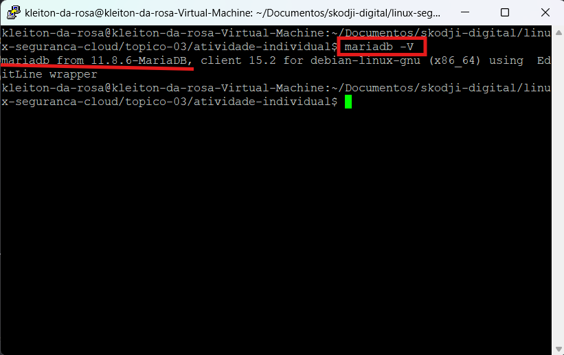
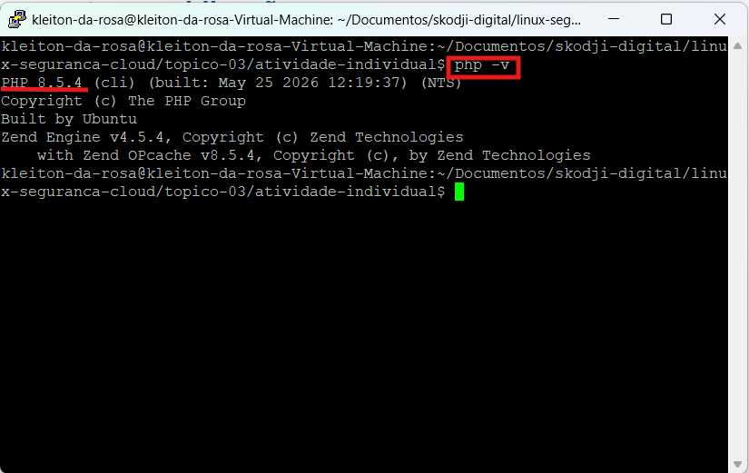
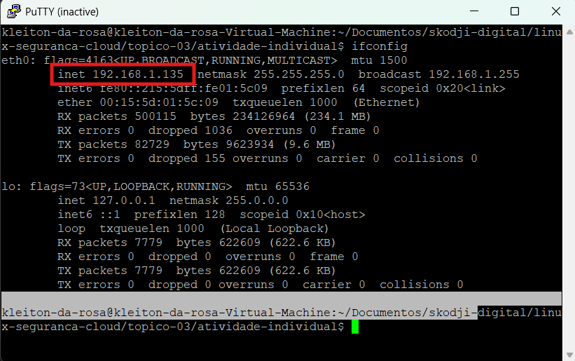
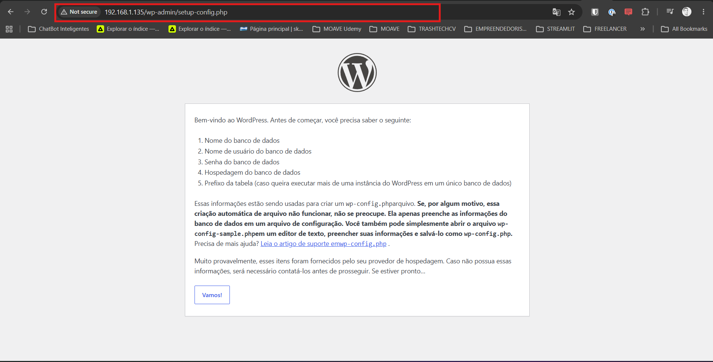

# Atividade prática individual - Tópico 3
## Nível realizado
 Nível 3
## Objetivo
Criar e publicar um serviço na web em ambiente Linux.
## Ambiente utilizado
VM local
## Rota de publicação
WordPress com Nginx
## URLs testados
http://192.168.1.135/wp-admin/setup-config.php
## Evidências produzidas

## Dificuldades encontradas
Nao foi encontrada dificuldades
## Link do repositório GitHub
https://github.com/Kleiton559/Linux-e-Seguran-a-na-Cloud/tree/main/topico-03/atividade-individual/evidencias
## Próximos passos
Indicar o que deve ser melhorado no Tópico 4, com foco em segurança.
